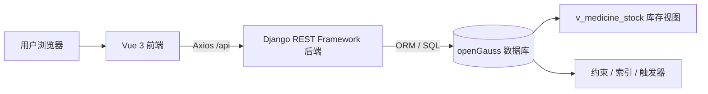
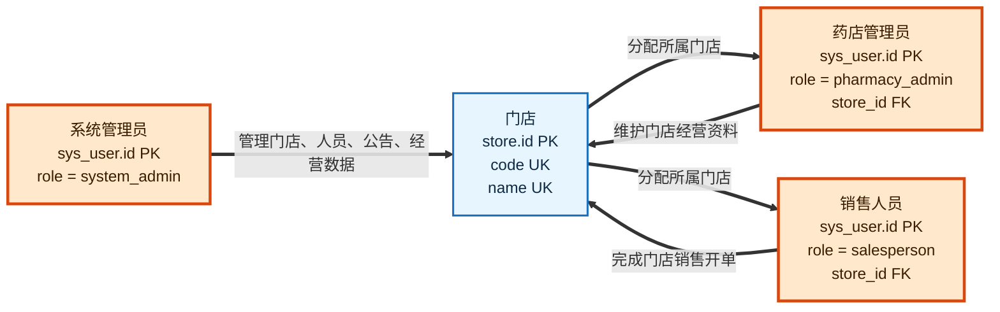
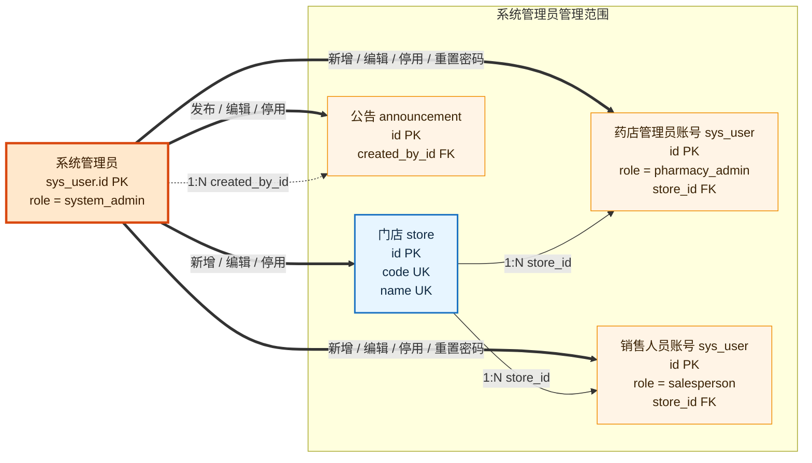
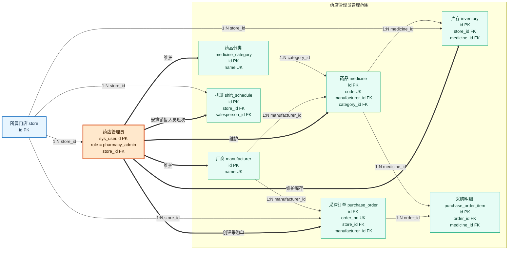
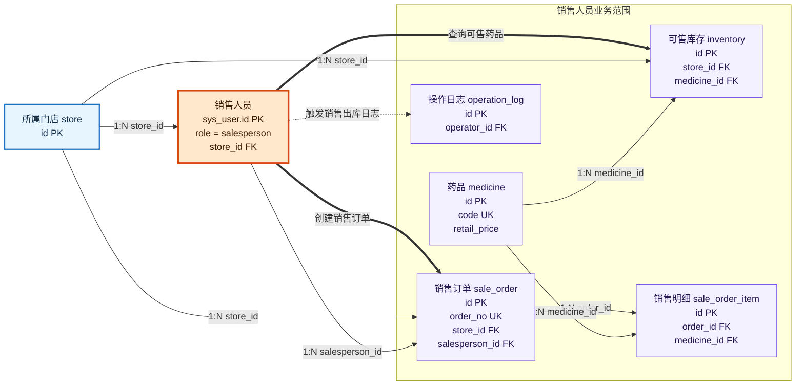
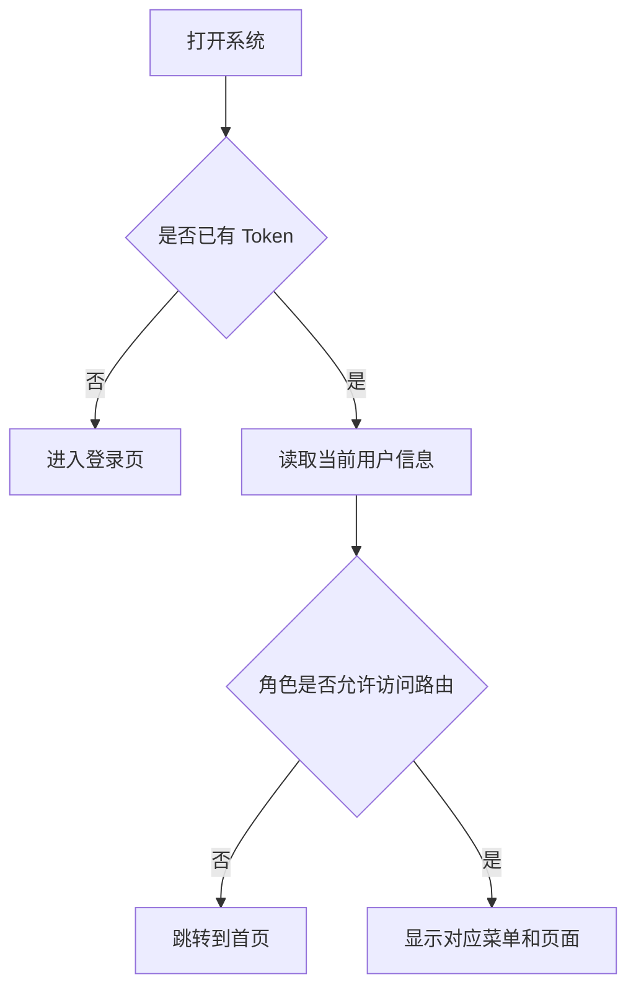
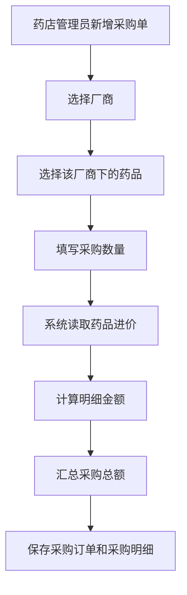
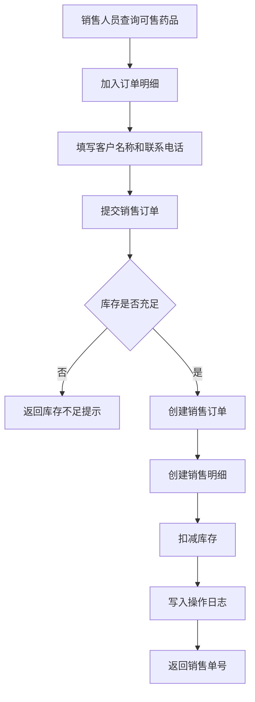

# 连锁药店系统

## 1. 项目概述

- **项目名称：** 连锁药店系统
- **项目类型：** 数据库应用系统课程设计
- **核心数据库：** openGauss
- **系统架构：** Vue 3 前端 + Django REST Framework 后端 + openGauss 数据库
- **推荐运行方式：** Docker Compose 或本地前后端分离开发

本项目面向连锁药店的日常经营管理场景，覆盖门店、人员、药品、厂商、库存、采购、销售、排班、公告和数据看板等业务。系统按照真实药店管理边界设计，不包含物流跟踪、订单评价等平台型电商功能。

系统包含三类角色：

| 角色 | 主要职责 | 数据范围 |
|---|---|---|
| 系统管理员 | 管理门店、药店管理员、销售人员、公告和连锁经营数据 | 全部门店 |
| 药店管理员 | 管理厂商、药品、库存、采购订单、销售人员排班 | 所属门店 |
| 销售人员 | 查询可售药品、创建销售订单、查看授权销售记录 | 所属门店 |

## 2. 功能概览

| 模块 | 功能说明 |
|---|---|
| 登录认证 | JWT 登录、角色识别、前端路由守卫 |
| 门店管理 | 门店新增、编辑、停用、搜索、详情查看，门店编码自动生成 |
| 用户管理 | 药店管理员和销售人员新增、编辑、停用、密码重置 |
| 厂商管理 | 厂商新增、编辑、停用、搜索，联系人和联系电话必填 |
| 药品管理 | 药品新增、编辑、停用、搜索，药品编码自动生成 |
| 药品分类 | 分类新增和维护 |
| 库存管理 | 门店库存维护、库存预警、低库存筛选、CSV 导出 |
| 采购订单 | 采购单号自动生成，采购明细按药品进价和数量自动计算金额 |
| 销售开单 | 选择库存药品加入订单，客户名称和联系电话必填，库存事务扣减 |
| 销售记录 | 按订单编号、客户、电话、日期查询销售记录和明细 |
| 排班管理 | 按星期选择排班，维护销售人员班次 |
| 公告管理 | 系统公告发布和展示 |
| 数据看板 | 营业额、订单、库存风险、热销药品、门店对比等统计展示 |

## 3. 技术栈

### 3.1 前端

- Vue 3
- Vite
- Vue Router
- Pinia
- Axios
- Element Plus

### 3.2 后端

- Python 3.9
- Django 4.2
- Django REST Framework
- Simple JWT
- gunicorn

### 3.3 数据库与部署

- openGauss 5.0.1
- SQL 初始化脚本
- Docker Compose
- nginx 前端静态资源服务

## 4. 系统架构



前端负责页面展示、表单交互、菜单权限和数据可视化；后端负责认证、权限校验、业务校验、事务处理和统计聚合；openGauss 负责保存业务数据，并通过主键、外键、唯一约束、检查约束、视图和触发器保证数据完整性。

## 5. 目录结构

```text
backend/
  apps/
    accounts/          用户、角色、排班
    announcements/     公告
    common/            公共模型、编号、看板统计
    inventory/         门店、库存、采购订单
    medicine/          厂商、分类、药品
    sales/             销售订单
  config/
  scripts/
  manage.py
  requirements.txt
frontend/
  src/
    api/               前端 API 封装
    layout/            主布局和侧边栏
    router/            路由权限
    stores/            Pinia 状态
    views/             页面组件
sql/
  schema.sql           数据库结构
  init_data.sql        演示数据
docker-compose.yml
start_project.bat
stop_project.bat
README.md
```

## 6. 数据库设计

### 6.1 主要实体

| 实体 | 表名 | 说明 |
|---|---|---|
| 门店 | `store` | 连锁药店门店信息 |
| 用户 | `sys_user` | 登录账号、角色和所属门店 |
| 公告 | `announcement` | 系统公告 |
| 厂商 | `manufacturer` | 药品生产厂商 |
| 药品分类 | `medicine_category` | 药品分类 |
| 药品 | `medicine` | 药品主数据 |
| 库存 | `inventory` | 门店级药品库存 |
| 采购订单 | `purchase_order` | 采购订单主表 |
| 采购明细 | `purchase_order_item` | 采购药品、数量、进价和金额 |
| 排班 | `shift_schedule` | 销售人员班次 |
| 销售订单 | `sale_order` | 销售订单主表 |
| 销售明细 | `sale_order_item` | 销售药品、数量、单价和金额 |
| 操作日志 | `operation_log` | 数据库触发器记录销售出库操作 |

### 6.2 角色主导 E-R 图

本项目的 E-R 图按照系统实际权限拆分为三组：系统管理员、药店管理员、销售人员。每张图都以对应角色作为中心节点，只展示该角色直接管理或直接产生的数据，避免把所有表放进一张图造成线条交叉。

#### 6.2.1 角色权限总览



#### 6.2.2 系统管理员 E-R 图

系统管理员负责连锁层面的基础资料和账号管理，不直接参与采购或销售业务。



#### 6.2.3 药店管理员 E-R 图

药店管理员围绕所属门店维护经营资料。采购订单采用“采购主表 + 采购明细表”，采购总额由采购明细自动汇总。



采购金额计算规则：

```text
采购明细金额 = 药品进价 × 采购数量
采购订单总额 = 同一采购订单下所有采购明细金额之和
```

#### 6.2.4 销售人员 E-R 图

销售人员只负责所属门店的销售开单和销售记录查看。销售订单不包含物流信息、订单评价和订单状态；客户名称、联系电话为必填项。



销售金额计算规则：

```text
销售明细金额 = 药品零售价 × 销售数量
销售订单总额 = 同一销售订单下所有销售明细金额之和
```

### 6.3 实体关系说明

| 关系 | 基数 | 说明 |
|---|---|---|
| 门店 - 用户 | 1:N | 一个门店可以分配多个药店管理员和销售人员 |
| 用户 - 公告 | 1:N | 系统管理员可以发布多条公告 |
| 厂商 - 药品 | 1:N | 一个厂商可以生产多种药品 |
| 药品分类 - 药品 | 1:N | 一个分类下可以包含多种药品 |
| 门店 - 库存 | 1:N | 一个门店维护多条药品库存记录 |
| 药品 - 库存 | 1:N | 同一种药品可以存在于多个门店库存中 |
| 门店 - 采购订单 | 1:N | 一个门店可以创建多张采购订单 |
| 采购订单 - 采购明细 | 1:N | 一张采购订单包含多条采购药品明细 |
| 门店 - 销售订单 | 1:N | 一个门店可以产生多张销售订单 |
| 销售订单 - 销售明细 | 1:N | 一张销售订单包含多条销售药品明细 |
| 销售人员 - 排班 | 1:N | 一个销售人员可以有多条排班记录 |

### 6.4 约束、索引、视图和触发器

| 类型 | 设计内容 |
|---|---|
| 主键 | 所有业务表均使用 `id` 作为主键 |
| 唯一约束 | 门店编码、门店名称、用户名、厂商名称、分类名称、药品编码、采购单号、销售单号 |
| 外键约束 | 用户-门店、药品-厂商、药品-分类、库存-门店/药品、订单-门店/用户、明细-订单/药品 |
| 检查约束 | 用户角色、药品价格、库存数量、采购数量、销售数量、订单金额 |
| 索引 | 药品名称、药品编码、厂商名称、库存门店、订单时间、采购状态等高频查询字段 |
| 视图 | `v_medicine_stock` 汇总门店、药品、厂商、库存和库存预警状态 |
| 触发器 | `fn_set_updated_at` 自动更新时间；`fn_log_sale_item` 记录销售出库日志 |

## 7. 编号规则

系统中的关键业务编号由系统自动生成，避免人工输入导致重复或格式不统一。

| 编号 | 示例 | 规则说明 |
|---|---|---|
| 门店编码 | `ST0001` | 按现有最大序号递增 |
| 药品编码 | `MED0001` | 按现有最大序号递增 |
| 采购单号 | `PO202605090001` | 前缀 + 日期 + 当日序号 |
| 销售单号 | `SO202605090001` | 前缀 + 日期 + 当日序号 |

## 8. 核心业务流程

### 8.1 登录与权限



### 8.2 采购订单创建



### 8.3 销售订单创建



## 9. 运行方式

### 9.1 Docker Compose 一键运行

适合第一次复现项目或只需要演示功能。

```powershell
Copy-Item .env.example .env
docker compose up -d --build
```

启动后访问：

- 前端：`http://127.0.0.1:8080`
- 后端：`http://127.0.0.1:8000`
- API 前缀：`http://127.0.0.1:8000/api`

停止服务：

```powershell
docker compose down
```

如果需要清空数据库卷并重新初始化：

```powershell
docker compose down -v
docker compose up -d --build
```

### 9.2 前后端分离开发

适合需要频繁修改代码的开发场景。

1. 启动数据库：

```powershell
Copy-Item .env.example .env
docker compose up -d db
```

2. 启动后端：

```powershell
Copy-Item backend\.env.example backend\.env
cd backend
python -m pip install -r requirements.txt
python scripts\init_compose_db.py
python manage.py runserver
```

3. 启动前端：

```powershell
Copy-Item frontend\.env.example frontend\.env
cd frontend
npm.cmd install
npm.cmd run dev
```

本地开发访问地址：

- 前端：`http://127.0.0.1:5173`
- 后端：`http://127.0.0.1:8000`

### 9.3 Windows 快速启动脚本

项目根目录提供：

```powershell
.\start_project.bat
.\stop_project.bat
```

使用前请确保：

- 本地 openGauss 已在 `127.0.0.1:5432` 运行
- `backend/.env` 已配置
- Python 和 Node.js 依赖已安装

## 10. 环境变量

根目录 `.env` 用于 Docker Compose：

```env
SECRET_KEY=replace-with-a-secure-secret-key
DEBUG=False
ALLOWED_HOSTS=127.0.0.1,localhost,backend
CORS_ALLOWED_ORIGINS=http://127.0.0.1:8080,http://localhost:8080
DB_NAME=pharmacy_system
DB_USER=gaussdb
DB_PASSWORD=your-password
DB_PORT=5432
INIT_DB_DEMO_DATA=True
OPENGAUSS_IMAGE=enmotech/opengauss:5.0.1
PYTHON_BASE_IMAGE=python:3.9-slim
NODE_BASE_IMAGE=node:20-alpine
NGINX_BASE_IMAGE=nginx:1.27-alpine
```

后端 `backend/.env` 用于本地开发：

```env
SECRET_KEY=replace-with-a-secure-secret-key
DEBUG=True
ALLOWED_HOSTS=127.0.0.1,localhost
CORS_ALLOWED_ORIGINS=http://127.0.0.1:5173,http://localhost:5173
DB_NAME=pharmacy_system
DB_USER=gaussdb
DB_PASSWORD=your-password
DB_HOST=127.0.0.1
DB_PORT=5432
DB_ADMIN_DB=postgres
INIT_DB_DEMO_DATA=True
```

注意：`.env`、`backend/.env`、`frontend/.env` 不应提交到 Git。

## 11. 演示账号

| 用户名 | 密码 | 角色 |
|---|---|---|
| `sysadmin` | `Admin@123` | 系统管理员 |
| `storeadmin` | `Admin@123` | 药店管理员 |
| `sales01` | `Admin@123` | 销售人员 |

## 12. 本地验证

后端检查：

```powershell
cd backend
python manage.py check
```

前端构建：

```powershell
cd frontend
npm.cmd run build
```

烟雾测试：

```powershell
cd backend
python scripts\smoke_check.py
```

建议至少验证：

- 三类角色均可登录
- 不同角色只能看到授权菜单
- 新增门店、药品、采购单时编号自动生成
- 新增采购单时采购总额由明细自动汇总
- 销售开单时客户名称、联系电话必填
- 销售成功后库存正确扣减
- 销售记录能查看订单明细
- 库存预警和数据看板能正常展示

## 13. SQL 文件说明

| 文件 | 作用 |
|---|---|
| `sql/schema.sql` | 创建表、主键、外键、唯一约束、检查约束、索引、视图和触发器 |
| `sql/init_data.sql` | 插入演示门店、用户、厂商、分类、药品、库存、采购、销售、排班和公告数据 |
| `sql/announcement_extension.sql` | 兼容保留文件，公告结构已合并到 `schema.sql` |
| `sql/sales_extension.sql` | 兼容保留文件，销售结构已合并到 `schema.sql` |

团队协作时以 `sql/schema.sql` 和 `sql/init_data.sql` 作为数据库结构与演示数据的权威来源。修改表结构或演示数据后，需要同步更新对应 SQL 文件。

## 14. 常见问题

### 14.1 Docker Hub 镜像拉取失败

如果出现网络超时，可以先从可用镜像源手动拉取并重新打标签：

```bash
docker pull docker.1ms.run/enmotech/opengauss:5.0.1
docker tag docker.1ms.run/enmotech/opengauss:5.0.1 enmotech/opengauss:5.0.1

docker pull docker.1ms.run/library/python:3.9-slim
docker tag docker.1ms.run/library/python:3.9-slim python:3.9-slim

docker pull docker.1ms.run/library/node:20-alpine
docker tag docker.1ms.run/library/node:20-alpine node:20-alpine

docker pull docker.1ms.run/library/nginx:1.27-alpine
docker tag docker.1ms.run/library/nginx:1.27-alpine nginx:1.27-alpine
```

然后执行：

```bash
docker compose up -d --build --pull never
```

### 14.2 页面能打开但没有数据

优先检查：

- 数据库是否已执行 `sql/schema.sql`
- 是否已导入 `sql/init_data.sql`
- `INIT_DB_DEMO_DATA` 是否为 `True`
- 前端 `/api` 是否正确代理到后端

### 14.3 修改字段后页面仍显示旧数据

建议重新构建前端并刷新浏览器缓存：

```powershell
cd frontend
npm.cmd run build
```

本地开发环境可重启 Vite：

```powershell
npm.cmd run dev
```

## 15. 提交前检查清单

- 后端 `python manage.py check` 通过
- 前端 `npm.cmd run build` 通过
- 三类演示账号均可登录
- 修改过的数据库结构已同步到 `sql/schema.sql`
- 修改过的演示数据已同步到 `sql/init_data.sql`
- README、开发手册、运行手册中的功能描述与系统当前行为一致
- 没有提交 `.env` 或数据库密码
