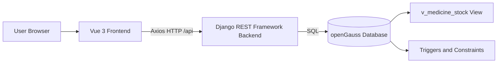
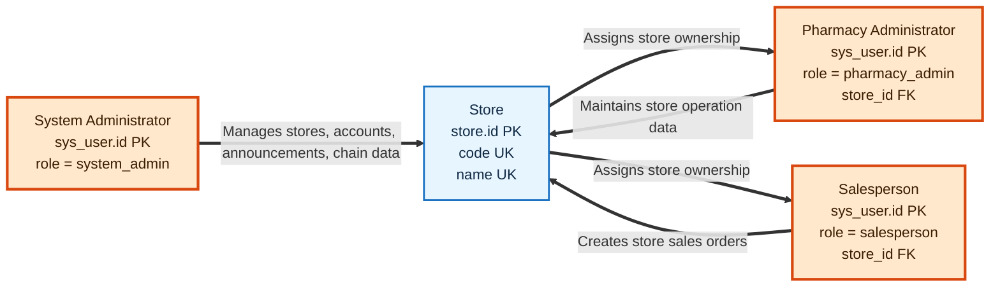
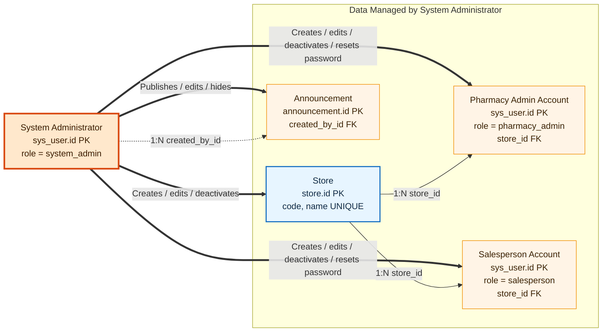
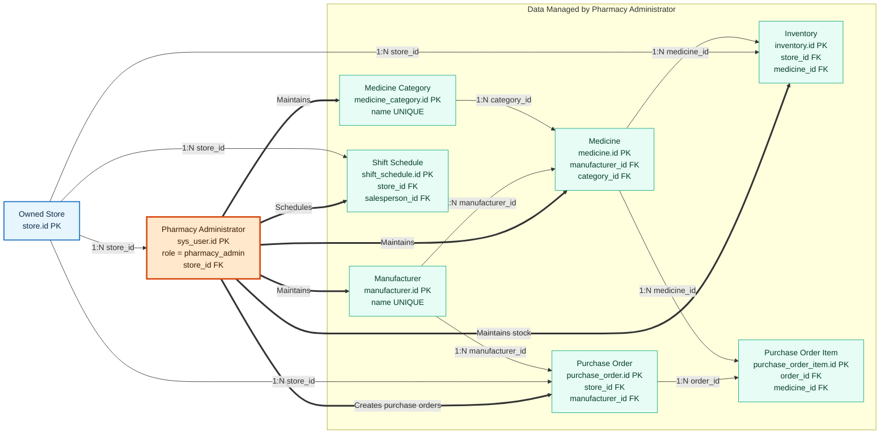
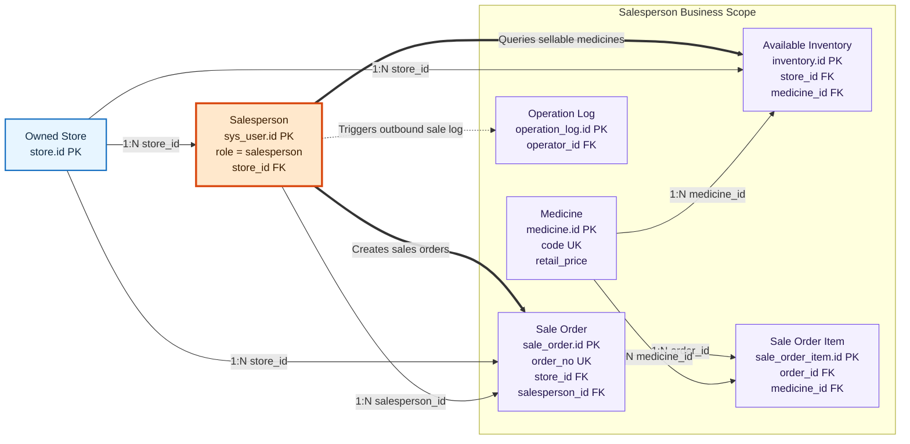
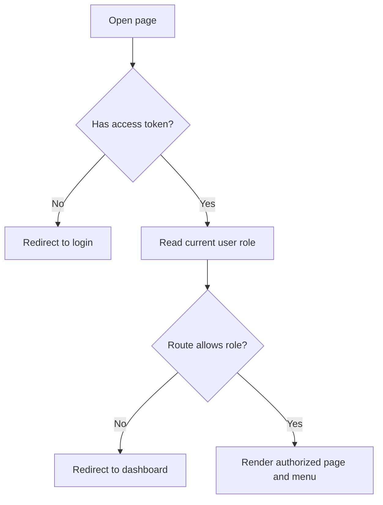
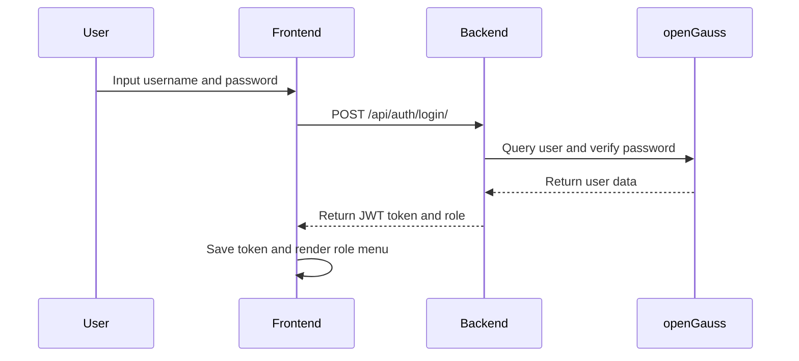
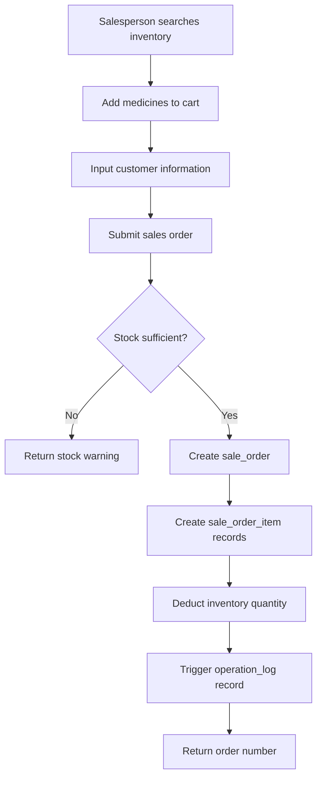
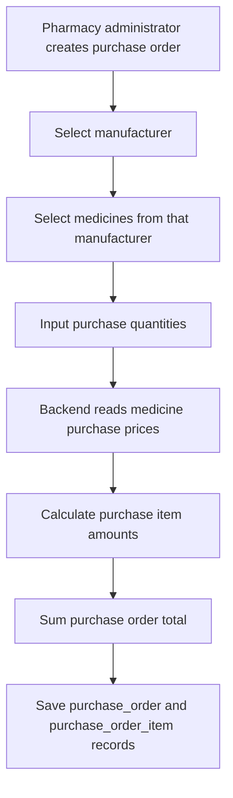
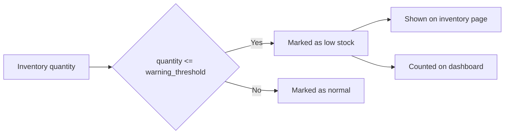

# Database Application System Development Manual

## 1. Project Overview

- **Project name:** Chain Pharmacy Management System
- **Project type:** Database application system course design
- **Core database:** Huawei openGauss
- **System architecture:** Browser + Vue frontend + Django REST backend + openGauss database
- **Recommended deployment:** Docker Compose

The project builds a complete management system for a chain pharmacy company. It covers daily business operations such as employee account management, pharmacy store management, medicine maintenance, inventory control, sales order creation, announcements, and business dashboard analysis.

The system is designed around three user roles:

- **System administrator:** manages stores, pharmacy administrators, salespersons, announcements, and chain-level business analysis.
- **Pharmacy administrator:** manages medicine data, manufacturers, inventory, purchase orders, and salesperson shift schedules for their own store.
- **Salesperson:** searches medicines, creates sales orders, and views authorized order records.

## 2. Project Planning

### 2.1 Objectives

The project aims to demonstrate the complete lifecycle of a database application:

- Analyze real business requirements for a chain pharmacy scenario.
- Design a relational database with entities, relationships, constraints, indexes, views, and triggers.
- Implement role-based permission control at both frontend and backend levels.
- Provide user-friendly CRUD pages for daily maintenance operations.
- Support fuzzy search by medicine name, manufacturer, code, order number, customer, phone number, and other key fields.
- Implement transaction-safe sales order creation and inventory deduction.
- Provide visual dashboards for supervisors to understand sales, stock risk, hot medicines, and store revenue.
- Package the system with Docker Compose so reviewers can reproduce it quickly.

### 2.2 Schedule

| Stage | Main work | Deliverables |
|---|---|---|
| Week 1 | Topic selection and requirement analysis | Requirement list, role list, business scope |
| Week 2 | Conceptual database design | Entity list, E-R relationship design |
| Week 3 | Logical and physical database design | Tables, keys, constraints, indexes |
| Week 4 | Backend API implementation | Django apps, serializers, permissions, REST APIs |
| Week 5 | Frontend implementation | Vue pages, route guards, management tables, forms |
| Week 6 | Testing, documentation, deployment | SQL files, Docker guide, demo accounts, manual, video |

## 3. Requirement Analysis

### 3.1 User Roles and Permissions

| Role | Main permissions | Business scope |
|---|---|---|
| System administrator | Manage stores, pharmacy administrators, salespersons, announcements, chain dashboard | All stores |
| Pharmacy administrator | Manage medicines, manufacturers, inventory, purchase orders, shift schedules | Own store |
| Salesperson | Search medicines, create sales orders, and view authorized orders | Own store |

### 3.2 Functional Requirements

| Requirement | Implementation |
|---|---|
| Login and identity recognition | JWT login API and frontend route guard |
| User management | Add, edit, deactivate, search, and reset password |
| Store management | Add, edit, delete, search, and view store details |
| Medicine management | Add, edit, soft delete, search by code/name/manufacturer |
| Manufacturer management | Add, edit, soft delete, fuzzy search |
| Inventory management | Add, edit, soft delete, warning threshold, low-stock filtering |
| Purchase order management | System-generated purchase order number, purchase item details, and automatic amount calculation |
| Sales order creation | Cart-style order creation, required customer information, stock validation, transaction-safe inventory deduction |
| Sales record query | Search by order number/customer/phone, date filtering, and detail view |
| Announcement management | Published announcements shown on dashboard |
| Visualization | Income trend, order trend, category ratio, hot medicines, stock risk, and store revenue ranking |
| Export | CSV export for inventory, sales records, and store revenue comparison |

### 3.3 Non-Functional Requirements

- **Reproducibility:** Docker Compose starts database, backend, and frontend with one command.
- **Data integrity:** openGauss constraints and backend validation prevent invalid data.
- **Security:** APIs require JWT authentication and role-based permissions.
- **Usability:** the interface provides search, filters, pagination, warning tags, dialogs, and export buttons.
- **Maintainability:** backend is split into apps, frontend is split into views and API modules, SQL files are stored separately.

## 4. System Architecture



The frontend is responsible for page rendering, route-level permission display, forms, tables, dashboards, and user interaction. The backend is responsible for authentication, API permission checking, validation, transaction processing, and data aggregation. openGauss stores business data and enforces relational integrity.

## 5. Technology Stack

### 5.1 Frontend

- Vue 3
- Vite
- Vue Router
- Pinia
- Axios
- Element Plus

### 5.2 Backend

- Python 3.9
- Django 4.2
- Django REST Framework
- Simple JWT
- gunicorn

### 5.3 Database and Deployment

- openGauss 5.0.1
- SQL scripts for schema and initial data
- Docker Compose
- nginx for serving the production frontend container

## 6. Database Design

### 6.1 Main Entities

| Entity | Table | Description |
|---|---|---|
| Store | `store` | Chain pharmacy store information |
| User | `sys_user` | System users and role information |
| Announcement | `announcement` | Published system announcements |
| Manufacturer | `manufacturer` | Medicine manufacturer information |
| MedicineCategory | `medicine_category` | Medicine classification |
| Medicine | `medicine` | Medicine master data |
| Inventory | `inventory` | Store-level stock quantity and warning threshold |
| PurchaseOrder | `purchase_order` | Store purchasing records |
| PurchaseOrderItem | `purchase_order_item` | Purchased medicine details, quantity, unit price, and amount |
| ShiftSchedule | `shift_schedule` | Salesperson shift schedule |
| SaleOrder | `sale_order` | Sales order header |
| SaleOrderItem | `sale_order_item` | Sales order item details |
| OperationLog | `operation_log` | Database-triggered operation records |

### 6.2 Role-Based E-R Diagrams

The E-R diagrams are organized around the three system roles: system administrator, pharmacy administrator, and salesperson. Each diagram uses the role as the central node and only shows data directly managed or generated by that role. This keeps the structure readable and avoids tangled lines caused by putting all tables into one diagram.

#### 6.2.1 Permission Overview



#### 6.2.2 System Administrator E-R Diagram

The system administrator manages chain-level master data and accounts. This role does not directly create purchase or sales business records.



#### 6.2.3 Pharmacy Administrator E-R Diagram

The pharmacy administrator maintains operational data for their own store. Purchase orders use a header-detail design: purchase amount is calculated from purchase order items instead of being manually entered.



Purchase amount calculation:

```text
Purchase item amount = medicine purchase price x purchase quantity
Purchase order total = sum of all item amounts under the same purchase order
```

#### 6.2.4 Salesperson E-R Diagram

The salesperson creates sales orders for their own store. Sales records only keep the order header, item details, customer information, amount, and timestamps. Customer name and customer phone are required business fields.



Sales amount calculation:

```text
Sales item amount = medicine retail price x sales quantity
Sales order total = sum of all item amounts under the same sales order
```

#### 6.2.5 Relationship Summary

| Relationship | Cardinality | Description |
|---|---|---|
| Store - User | 1:N | One store can have multiple pharmacy administrators and salespersons |
| User - Announcement | 1:N | A system administrator can publish multiple announcements |
| Manufacturer - Medicine | 1:N | One manufacturer can produce multiple medicines |
| Medicine Category - Medicine | 1:N | One category can contain multiple medicines |
| Store - Inventory | 1:N | One store maintains many medicine stock records |
| Medicine - Inventory | 1:N | One medicine can be stocked by multiple stores |
| Store - Purchase Order | 1:N | One store can create multiple purchase orders |
| Purchase Order - Purchase Order Item | 1:N | One purchase order contains multiple purchased medicines |
| Store - Sale Order | 1:N | One store can generate multiple sales orders |
| Sale Order - Sale Order Item | 1:N | One sales order contains multiple sold medicines |
| Salesperson - Shift Schedule | 1:N | One salesperson can have multiple shift records |

### 6.3 Physical Design Highlights

- Primary keys are defined for every business table.
- Foreign keys connect users, stores, medicines, inventory, and orders.
- Unique constraints are defined for store code, store name, username, manufacturer name, medicine category name, medicine code, inventory store-medicine pair, purchase order number, and sale order number.
- Check constraints validate role values, prices, inventory quantities, purchase status, item quantity, and item amount.
- Indexes are defined on high-frequency query fields such as medicine name, medicine code, manufacturer name, store, inventory medicine, purchase order status, and order creation time.
- A database view `v_medicine_stock` provides a stock overview with store, medicine, manufacturer, quantity, warning threshold, and warning status.
- Trigger `fn_set_updated_at` automatically refreshes `updated_at` when records are modified.
- Trigger `fn_log_sale_item` writes sale item insertion records into `operation_log`.

### 6.4 Important SQL Files

| File | Purpose |
|---|---|
| `sql/schema.sql` | Creates tables, constraints, indexes, view, and triggers |
| `sql/init_data.sql` | Inserts demo stores, users, medicines, inventory, purchase orders, purchase order items, sales orders, sales order items, announcements, and schedules |
| `sql/announcement_extension.sql` | Compatibility no-op; announcement schema is merged into `schema.sql` |
| `sql/sales_extension.sql` | Compatibility no-op; sales schema is merged into `schema.sql` |

## 7. Backend Design

### 7.1 Django Apps

| App | Responsibility |
|---|---|
| `accounts` | Login, current user, user management, role permissions, shift schedules |
| `medicine` | Manufacturer, category, and medicine APIs |
| `inventory` | Store, inventory, and purchase order APIs |
| `sales` | Sales order and order item APIs |
| `announcements` | Announcement CRUD APIs |
| `common` | Dashboard overview and statistical aggregation |

### 7.2 Main API Modules

| API prefix | Description |
|---|---|
| `/api/auth/` | Login and current user |
| `/api/users/` | User and shift schedule management |
| `/api/medicines/` | Manufacturer, category, medicine management |
| `/api/inventory/` | Store, inventory, purchase order management |
| `/api/sales/` | Sales orders and order items |
| `/api/announcements/` | Announcement management |
| `/api/dashboard/` | Dashboard statistics |

### 7.3 Permission Control

The backend uses DRF permission classes to protect APIs:

- `IsSystemAdmin`: only system administrators can manage stores, pharmacy administrators, salespersons, and announcements.
- `IsPharmacyAdmin`: only pharmacy administrators can manage medicines, manufacturers, inventory, purchase orders, and shift schedules.
- `InventoryPermission`: pharmacy administrators can write inventory data; salespersons can only read it.
- `SalesPermission`: all roles can read authorized sales records; only salespersons can create sales orders.

## 8. Frontend Design

### 8.1 Page Structure

| Page | Main users | Main features |
|---|---|---|
| Login | All users | Login with demo or created accounts |
| Dashboard | All users | Business overview, income trend, stock risk, hot medicines, and store activity |
| Store Management | System administrator | Store CRUD and details |
| Pharmacy Admin Management | System administrator | Manage pharmacy administrators |
| Salesperson Management | System administrator | Manage salespersons |
| Announcement Management | System administrator | Publish and maintain announcements |
| Revenue Comparison | System administrator | Store revenue ranking, period filter, CSV export |
| Manufacturer Management | Pharmacy administrator | Manufacturer CRUD |
| Medicine Management | Pharmacy administrator, salesperson read-only | Medicine CRUD and fuzzy query |
| Inventory Management | Pharmacy administrator, salesperson read-only | Stock maintenance, warning filter, pagination, CSV export |
| Purchase Orders | Pharmacy administrator | Purchase order header and item management, automatic amount calculation |
| Shift Schedules | Pharmacy administrator | Salesperson scheduling |
| Sales Create | Salesperson | Search medicines, cart, required customer information, submit order |
| Sales Records | All roles | Search, date filter, pagination, detail view, CSV export |

### 8.2 Frontend Permission Flow



### 8.3 Visual Dashboard Design

The dashboard is designed for supervisors and store managers. It contains:

- Total orders, revenue, store count, employee count.
- Monthly and yearly order/revenue summary.
- Low-stock and near-expiry risk cards.
- Low-stock item list and near-expiry medicine list.
- Ten-day income line chart.
- Ten-day order bar chart.
- Top-selling medicines in the last 30 days.
- Medicine category stock ratio.
- Published announcements.
- Seven-day business activity records.

## 9. Core Business Processes

### 9.1 Login Process



### 9.2 Sales Order Process



The backend wraps order creation and inventory deduction in a database transaction. If any item has insufficient stock, the order is rejected and inventory remains unchanged.

### 9.3 Purchase Order Process



Purchase amounts are calculated by the backend. Users do not manually enter the final purchase order amount.

### 9.4 Inventory Warning Process



## 10. Testing

### 10.1 Functional Test Cases

| No. | Test case | Expected result |
|---|---|---|
| 1 | Login as `sysadmin` | System administrator menu is displayed |
| 2 | Login as `storeadmin` | Pharmacy administrator menu is displayed |
| 3 | Login as `sales01` | Salesperson menu is displayed |
| 4 | System administrator creates a pharmacy administrator | User appears in pharmacy administrator table |
| 5 | System administrator resets password | Target user can login with `Admin@123` |
| 6 | Pharmacy administrator creates a medicine | Medicine appears in medicine table |
| 7 | Pharmacy administrator creates a purchase order | Purchase number is generated and amount is calculated from items |
| 8 | Search medicine by code/name/manufacturer | Matching records are returned |
| 9 | Pharmacy administrator updates inventory | Quantity and warning status are updated |
| 10 | Salesperson creates a sales order | Order is created and inventory is deducted |
| 11 | Salesperson submits order without customer name or phone | Request is rejected with required-field warning |
| 12 | Salesperson creates order with insufficient stock | Request is rejected with stock warning |
| 13 | View order detail | Order items are displayed |
| 14 | Dashboard opens after login | Charts and risk cards load successfully |
| 15 | Export inventory/sales/revenue CSV | Browser downloads the CSV file |
| 16 | Unauthorized route access | User is redirected to dashboard |

### 10.2 Smoke Check

The project includes `backend/scripts/smoke_check.py` for basic API checks after the backend is running.

## 11. Deployment and Reproduction

### 11.1 Docker Compose Mode

```powershell
Copy-Item .env.example .env
docker compose up -d --build
```

Access:

- Frontend: `http://127.0.0.1:8080`
- Backend: `http://127.0.0.1:8000`
- API prefix: `http://127.0.0.1:8000/api`

### 11.2 Local Development Mode

```powershell
Copy-Item .env.example .env
docker compose up -d db
Copy-Item backend\.env.example backend\.env
cd backend
python -m pip install -r requirements.txt
python scripts\init_compose_db.py
python manage.py runserver
```

```powershell
cd frontend
Copy-Item .env.example .env
npm.cmd install
npm.cmd run dev
```

Access:

- Frontend: `http://127.0.0.1:5173`
- Backend: `http://127.0.0.1:8000`

## 12. Demo Accounts

| Username | Password | Role |
|---|---|---|
| `sysadmin` | `Admin@123` | System administrator |
| `storeadmin` | `Admin@123` | Pharmacy administrator |
| `sales01` | `Admin@123` | Salesperson |

## 13. Contribution Description

If submitted by a group, replace the member names before final submission.

| Member | Main contribution |
|---|---|
| Member 1 | Requirement analysis, database design, SQL schema, initial data |
| Member 2 | Backend API, authentication, permissions, transaction logic |
| Member 3 | Frontend pages, dashboard visualization, user interaction |
| Member 4 | Testing, documentation, Docker deployment, demo video |

If submitted individually, the student completed requirement analysis, database design, backend development, frontend development, testing, documentation, and deployment independently.

## 14. Conclusion

The Chain Pharmacy Management System satisfies the database course design requirements. It is based on openGauss, implements three role types, supports CRUD operations, fuzzy query, user permission management, transaction-safe sales processing, and a user-friendly visual interface. The system also provides Docker-based reproduction, complete SQL files, demo data, and documentation suitable for course submission and demonstration.
